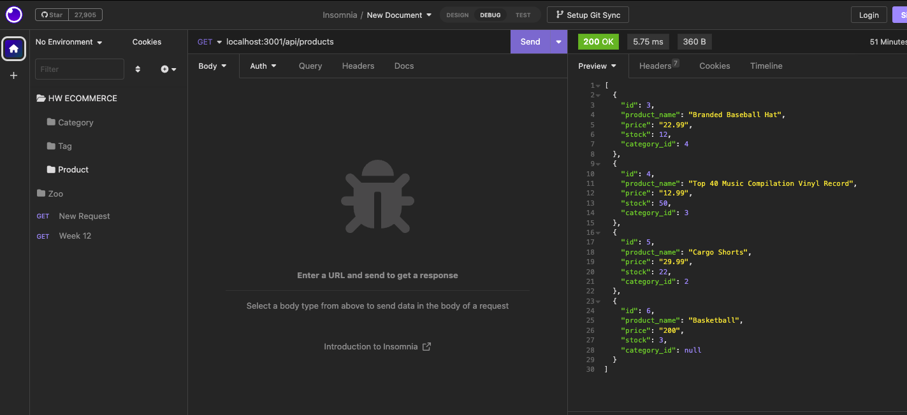
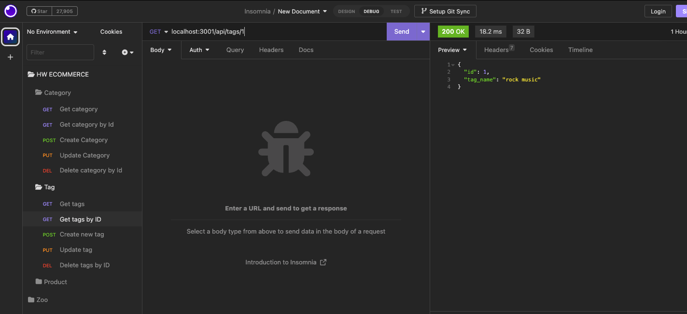
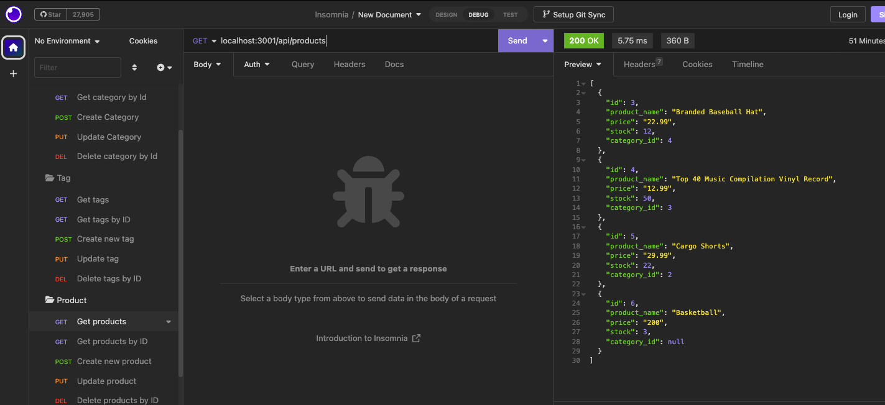

# my-e-commerce-orm

## Description

This is a E-commerce connected to a database, able to get, update, delete, change categories, products by name or by their Id. I used ExpressJs to build the apis, Sequelize to interact with the MySql database and make changes. I learned more about the get, post, put and delete routes with them referencing the correct items. Found out the Sequelize makes life a lot easier when it comes to Referencing different things together is much more simple then using SQL by itself!

## Usage
Right click the main server.js file and go to integrated terminal, type npm i. Then node server.js, then go to your local host or insomnia and you can find things by api/categories or products or tag.

Here is the link to GitHub:  https://github.com/Derekchili/my-e-commerce-orm.git

Here is the link to the video: https://drive.google.com/file/d/1VQxQJYTwKw4UZ2LnA1nXCYiZOjx3HG1V/view

## Credits

Used the class repo to get some of the routes right, also had help from a classmate Will Asbury. Tutor Andres Jiminez helped me this morning to get some things finalized to get the project working without errors.

